 

  

## 🌿 About Me

<table width="100%">
<tr>

<td width="60%" valign="top">

### Hey! I'm Siddika 👋

I'm a **B.Tech Computer Science student** interested in software development, backend engineering and problem solving.

- 🎓 B.Tech CSE Student
- ☕ Currently learning **Java & Spring Boot**
- 🧠 Practicing **Data Structures & Algorithms**
- 🚀 Exploring **Backend Development**
- 💻 Solving problems on **LeetCode**
- 🌱 Learning and building every day
- 📍 Kolkata, India

</td>

<td width="40%" valign="top" align="center">

</td>

</tr>
</table>

  

## 🛠️ Tech Stack

 

 

  

## 📊 GitHub Activity

<table>
<tr>

<td width="50%" align="center">

</td>

<td width="50%" align="center">

</td>

</tr>
</table>

 

## 🐍 Contribution Snake

<picture>
  <source
    media="(prefers-color-scheme: dark)"
    srcset="https://raw.githubusercontent.com/Siddika-29s/Siddika-29s/output/github-contribution-grid-snake-dark.svg"
  />

  <source
    media="(prefers-color-scheme: light)"
    srcset="https://raw.githubusercontent.com/Siddika-29s/Siddika-29s/output/github-contribution-grid-snake.svg"
  />

  

</picture>

 

